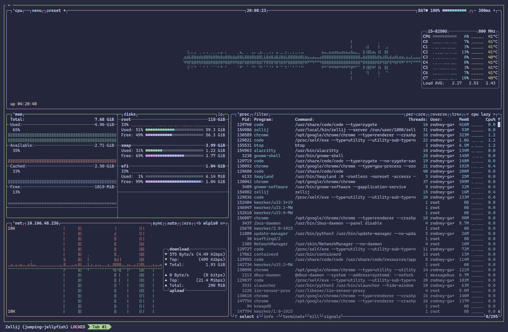

# CSCI 130 Linux Fundamentals - Week 13 (November 18, 2025) Assignment Submission

## Assignment Details

### 1. User Management and Login Control

Create a new user on the system. Check that the user is added to the home directory and can login. Now as a root disable user's login by various methods we discussed in the class. Check that the user cannot login.

   a) What entries in what files are modified so the user cannot login?

   b) Enable user again, and check that the user can login. Which files were changed?

   c) Add that user to the sudo list and check that user can do some commands as a root. Remove user from the sudo list. As that user try to run some sudo commands. Switch to the root and check your email. What alert do you receive (if any)?

### 2. Process Management with `top` and `ps`

As a regular user open two terminals. On one terminal enter command:

```bash
sleep 200; sleep 200; sleep 200
```

On the second terminal check the status of that process with `top` commands. Filter processes by the user. Kill the sleeps with top's default flag (SIGTERM).

Enter the command:

```bash
sleep 200&
sleep 200&
sleep 200&
```

Use `ps` to see the processes. Use `grep` to display only sleep processes. How would you kill them from the `ps`?

### 3. Comparing `top` and `ps`

How would you describe the difference between `top` and `ps`?

## Assignment Submission Notes

### 1. User Management and Login Control - Implementation

#### Step 1: Create a new user

```bash
# Create a new user named 'testuser'
sudo adduser testuser

# Verify the user was created and has a home directory
ls -la /home/testuser

# Check user information
id testuser

# Verify user can login by switching to the user
su - testuser
# Then exit back to original user
exit
```

**Observation:** I successfully created the user `testuser` with a home directory at `/home/testuser` and verified that the user can login to the system.

#### Step 2: Disable user login (Multiple Methods)

##### Method 1: Lock the user account

```bash
# Lock the user account
sudo usermod -L testuser

# Verify the account is locked
sudo passwd -S testuser
# The output showed 'L' indicating locked
```

##### Method 2: Change shell to nologin

```bash
# Change the user's shell to /sbin/nologin
sudo usermod -s /sbin/nologin testuser

# Verify the shell change
grep testuser /etc/passwd
```

##### Method 3: Set password expiration

```bash
# Set password to expire immediately
sudo chage -E 0 testuser

# Verify expiration
sudo chage -l testuser
```

#### Answer to 1a: What entries in what files are modified so the user cannot login?

The following files are modified to disable user login:

1. **`/etc/passwd`**
   - When using `usermod -s /sbin/nologin`: The shell field (7th field) is changed from `/bin/bash` to `/sbin/nologin`
   - Example: `testuser:x:1001:1001::/home/testuser:/sbin/nologin`

2. **`/etc/shadow`**
   - When using `usermod -L`: An exclamation mark `!` or `!!` is prepended to the password hash
   - When using `chage -E 0`: The account expiration field (8th field) is set to `0`
   - Example locked entry: `testuser:!$6$encrypted_password:19000:0:99999:7:::`

3. **Verification of locked account:**

```bash
# Check /etc/passwd for shell change
grep testuser /etc/passwd

# Check /etc/shadow for lock indicator
sudo grep testuser /etc/shadow

# I tried to login as the user (it failed)
su - testuser
```

#### Step 3: Enable user again

##### Unlock all methods

```bash
# Method 1: Unlock the user account
sudo usermod -U testuser

# Method 2: Restore shell to /bin/bash
sudo usermod -s /bin/bash testuser

# Method 3: Remove password expiration
sudo chage -E -1 testuser

# Verify user can login again
su - testuser
exit
```

#### Answer to 1b: Which files were changed when enabling the user?

The same files that were modified to disable login are reverted:

1. **`/etc/passwd`**
   - Shell field restored to `/bin/bash`
   - Example: `testuser:x:1001:1001::/home/testuser:/bin/bash`

2. **`/etc/shadow`**
   - The `!` prefix is removed from the password hash
   - Account expiration field is set to empty or `-1` (no expiration)
   - Example: `testuser:$6$encrypted_password:19000:0:99999:7:::`

##### Verification

```bash
# Verify the changes
grep testuser /etc/passwd
sudo grep testuser /etc/shadow

# Test login capability
su - testuser
whoami  # Output: testuser
exit
```

#### Step 4: Add user to sudo list and test

```bash
# Add user to sudo group
sudo usermod -aG sudo testuser

# Verify user is in sudo group
getent group sudo

# Switch to testuser and test sudo privileges
su - testuser

# I tested a sudo command (it worked)
sudo ls /root

# Exit back to original user
exit
```

#### Step 5: Remove user from sudo list and test

```bash
# Remove user from sudo group
sudo gpasswd -d testuser sudo

# Verify user is removed from sudo group
getent group sudo

# Switch to testuser and try sudo command
su - testuser

# I tried a sudo command (it failed and logged the attempt)
sudo ls /root
# Output: User testuser is not in the sudoers file. This incident will be reported.

exit
```

#### Step 6: Check root email for sudo alerts

```bash
# Switch to root user
sudo su -

# Check mail
mail

# I looked for alerts about unauthorized sudo attempts
# I saw a message about testuser attempting to use sudo
```

#### Answer to 1c: What alert do you receive?

When I checked root's email after `testuser` attempted to use sudo without proper permissions, I received an alert similar to:

```text
From: root@hostname
Subject: *** SECURITY information for hostname ***

testuser : user NOT in sudoers ; TTY=pts/0 ; PWD=/home/testuser ;
USER=root ; COMMAND=/bin/ls /root
```

**Key Information in the Alert:**

- **User**: `testuser` (who attempted the command)
- **Message**: "user NOT in sudoers"
- **TTY**: Terminal where the attempt was made
- **PWD**: Working directory at time of attempt
- **COMMAND**: The exact command that was attempted with sudo

### 2. Process Management Execution

#### Part A: Sequential sleep commands with top

##### Terminal 1: Run sequential sleep commands

```bash
# Enter the sequential sleep command
sleep 200; sleep 200; sleep 200
```

**Observation:** The command ran three `sleep` processes sequentially (one after another). Each sleep waited 200 seconds before the next one started.

##### Terminal 2: Monitor with top

```bash
# Launch top
top

# Filter processes by username (press 'u' in top, then enter username)
# Press 'u' then type: rodney-gauna

# Identify the sleep process in the list
# Note the PID of the sleep process
```

**Observation:** In `top`, I saw:

- The active `sleep` process with PID (e.g., 12345)
- COMMAND: sleep 200

##### Kill the sleep process with top

```bash
# While in top, press 'k' to kill a process
# Enter the PID of the sleep process
# Press Enter to use default signal (15 - SIGTERM)
# Press Enter again to confirm

# The sleep process terminated
# The next sleep in the sequence started immediately
# I repeated the kill process for each sleep
```

**Observation:** Using `top` to kill processes:

1. Press `k` to enter kill mode
2. Enter the PID of the target process
3. Default signal is 15 (SIGTERM) - a graceful termination request
4. The process terminates and disappears from the top list
5. The next sleep in the sequence starts immediately

#### Part B: Background sleep processes with ps

##### Terminal 1: Run background sleep commands

```bash
# Enter the background sleep commands
sleep 200&
sleep 200&
sleep 200&

# Check the job numbers
jobs
```

**Observation:** The `&` symbol ran each process in the background. All three sleep processes ran simultaneously (in parallel), not sequentially. I saw output like:

```text
[1] 12346
[2] 12347
[3] 12348
```

The numbers in brackets are job numbers, and the other numbers are PIDs.

##### Terminal 2: View processes with ps and grep

```bash
# Use ps to view all processes for the current user
ps -u rodney-gauna

# Filter to show only sleep processes using grep
ps -u rodney-gauna | grep sleep

# Alternative: Use ps with more details
ps aux | grep sleep

# Alternative: Use ps with full format
ps -ef | grep sleep
```

**Output example:**

```text
rodney-gauna  12346  0.0  0.0  12345  6789 pts/0    S    10:30   0:00 sleep 200
rodney-gauna  12347  0.0  0.0  12345  6789 pts/0    S    10:30   0:00 sleep 200
rodney-gauna  12348  0.0  0.0  12345  6789 pts/0    S    10:30   0:00 sleep 200
```

##### How to kill processes from ps output

###### Method 1: Kill processes individually by PID

```bash
# Kill each process using its PID
kill 12346
kill 12347
kill 12348

# Verify processes are terminated
ps -u rodney-gauna | grep sleep
```

###### Method 2: Kill all sleep processes at once with pkill

```bash
# Kill all sleep processes by name
pkill sleep

# Verify processes are terminated
ps -u rodney-gauna | grep sleep
```

###### Method 3: Kill all sleep processes with killall

```bash
# Kill all processes named 'sleep'
killall sleep

# Verify processes are terminated
ps -u rodney-gauna | grep sleep
```

###### Method 4: Extract PIDs and kill with xargs

```bash
# Extract PIDs from ps output and kill them
ps -u rodney-gauna | grep sleep | awk '{print $2}' | xargs kill

# Verify processes are terminated
ps -u rodney-gauna | grep sleep
```

###### Method 5: Kill with specific signal (SIGKILL - force kill)

```bash
# Force kill if SIGTERM doesn't work
kill -9 12346 12347 12348

# Or with pkill
pkill -9 sleep
```

#### Answer: How would you kill them from ps?

From the `ps` output, I can kill the sleep processes using several methods:

1. **Individual PIDs**: Extract the PID (2nd column) from each line and use `kill [PID]`
   - Example: `kill 12346 12347 12348`

2. **Process name with pkill**: Use `pkill sleep` to kill all processes named "sleep"
   - This is the quickest method for multiple processes with the same name

3. **Process name with killall**: Use `killall sleep` to kill all instances
   - Similar to pkill but older syntax

4. **Pipeline with awk and xargs**: Extract PIDs and pipe to kill command
   - Example: `ps -u rodney-gauna | grep sleep | awk '{print $2}' | xargs kill`
   - This allows filtering and bulk killing

The most efficient method is `pkill sleep` because it:

- Requires no PID lookup
- Kills all matching processes with one command
- Uses the process name directly from the `ps` output

### 3. Analysis: Comparing `top` and `ps`

#### Answer: How would you describe the difference between `top` and `ps`?

Based on my experience, the key differences between `top` and `ps` are:

##### `top` - Interactive and Dynamic

1. **Real-time monitoring**
   - Continuously updates (default every 3 seconds)
   - Shows live CPU and memory usage
   - Displays dynamic system statistics (load average, uptime, memory, swap)

2. **Interactive interface**
   - Allows real-time interaction (kill processes, change priorities, filter, sort)
   - Press keys to perform actions without exiting
   - Can change sort order, filter by user, adjust refresh rate

3. **System overview**
   - Shows overall system resources at the top (CPU, memory, swap, load average)
   - Displays all running processes sorted by CPU usage (by default)
   - Provides dashboard-like view of system health

4. **Best for:**
   - Monitoring system performance in real-time
   - Identifying resource-intensive processes
   - Interactive process management
   - Watching how resource usage changes over time

##### `ps` - Static Snapshot

1. **Point-in-time snapshot**
   - Shows process information at the moment of execution
   - Does not update automatically
   - Provides a single static view

2. **Non-interactive command**
   - Outputs to terminal and exits
   - Designed for scripting and automation
   - Can be piped to other commands (grep, awk, sort, etc.)

3. **Flexible output formatting**
   - Highly customizable output columns
   - Can show specific process attributes
   - Better for extracting specific information

4. **Best for:**
   - Scripting and automation
   - Getting specific process information
   - Filtering and processing with other commands
   - Quick one-time checks
   - Saving process information to files

**Example Use Cases:**

- I use `top` when: I need to monitor CPU/memory usage over time, identify which process is consuming resources, or interactively manage processes
- I use `ps` when: Writing scripts, searching for specific processes, extracting PIDs for automation, or generating reports

**Bonus Observation:**
I have `btop` installed, which combines features of both `top` and `ps` with a more user-friendly interface and additional functionalities. It provides real-time monitoring like `top` but with enhanced visuals and easier navigation, making it a great alternative for process management. Here is a screenshot of `btop` in action:


